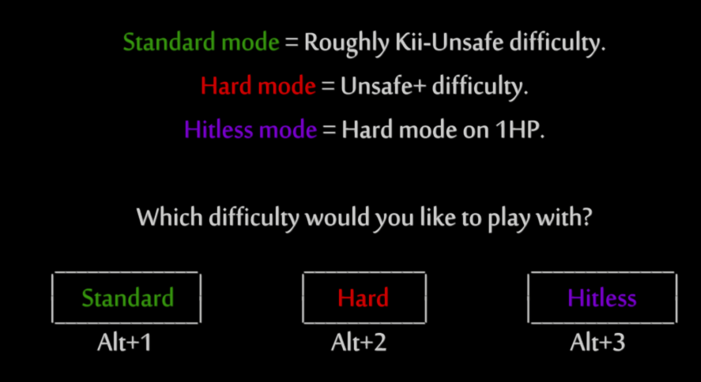

# [BitbAem!](/BitbAem.wotwr)

A high-difficulty challenge centered around Bash.

**[Download latest v4 zip](https://github.com/pizzaspren/BitbAem/releases/download/v4-release/BitbAem.zip)**

## v4 Disclaimer

This is the original version of **BitbAem!**, made for the v4 Randomizer. If you are looking for the v5 version, check out this other link -> _Placeholder_

---

## Demo version

The file *BitbAem_DEMO.wotwr* is a short version of the plando that mirrors the hard mode mechanics for the first area. You can try it out before the main plando if you are unsure about the difficulty of hard mode.

- **Difficulty**: Unsafe
- **Time estimate**: 1 hour

----
# Difficulty selection

When launching the seed for the first time you will be presented with an in-game menu to select the difficulty.

**Regardless of what you intend to play, the Ori savefile must be set to "Normal" when launching.**

## Standard mode

- **Difficulty**: Kii~Unsafe (At the time of publishing)
- **Time estimate**: 6 hours

## Hard mode

- **Difficulty**: Unsafe
- **Time estimate**: 10 hours

## Hitless mode

Same as hard mode, but with 1 hitpoint. Some tricks require working around your low health and making detours to fetch other things.

- **Difficulty**: All of it. Are you insane?
- **Time estimate**: 13-15 hours

---

# Trick walkthrough repository

Tricks for hard + hitless routing. TBD.
